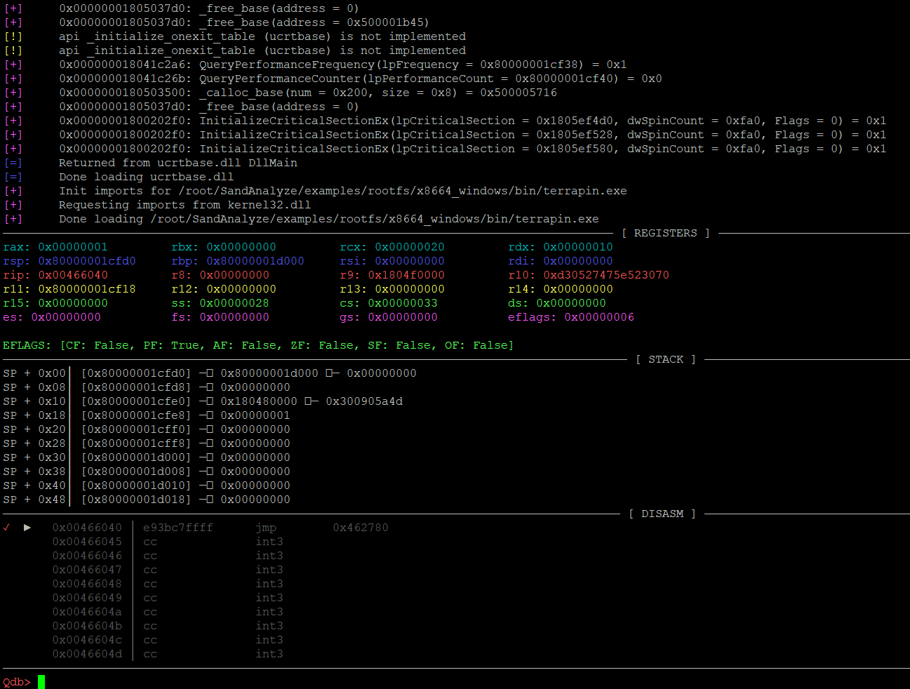
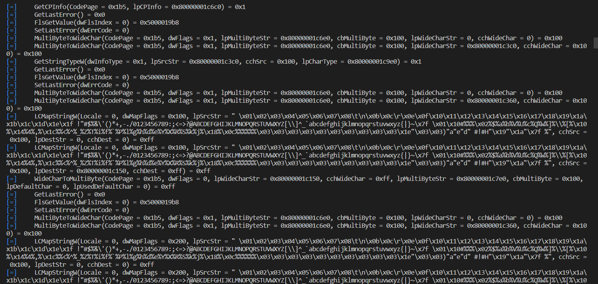

# SandAnalyze
Simulate Windows EXE for Malware Research!

<b>What is This ?</b>

<b>ENGLISH</b>
 
SandAnalyze is a program that allows you to examine Windows EXE files on Linux with the help of GDB Debugger and perform operations on memory.
  
<b>TURKISH</b>
 
SandAnalyze, Linux üzerinde Windows EXE dosyalarını GDB Debugger yardımıyla inceleyebileceğiniz ve memory üzerinde işlem yapabileceğiniz bir programdır.

 

 

<b>Installation</b>

<b>ENGLISH</b>
 
First, run the "dllscollector.bat" file on a Windows computer.

If the file you want to examine is 32 bit, copy the EXE file into the "examples/rootfs/x86_windows/bin" folder, if it is 64 bit, copy the EXE file into the "examples/rootfs/x8664_windows/bin" folder.

Then, run the "pip3 install -r requirements.txt" command on a Linux computer and install the Python PIP packages.

After all these procedures, you can start examining your EXE file with the "python3 example.py example.exe" command.
  
<b>TURKISH</b>
 
Öncelikle, Windows bir bilgisayar üzerinde "dllscollector.bat" dosyasını çalıştırın.

İncelemek istediğiniz dosya eğer 32 bit ise "examples/rootfs/x86_windows/bin" klasörü içerisine, 64 bit ise "examples/rootfs/x8664_windows/bin" klasörü içerisine EXE dosyasını kopyalayın

Ardından Linux bir bilgisayar üzerinden "pip3 install -r requirements.txt" komutunu çalıştırıp Python PIP paketlerini kurun.

Tüm bu işlemlerden sonra "python3 example.py example.exe" komutuyla EXE dosyanızı incelemeye başlayabilirsiniz.

 

 